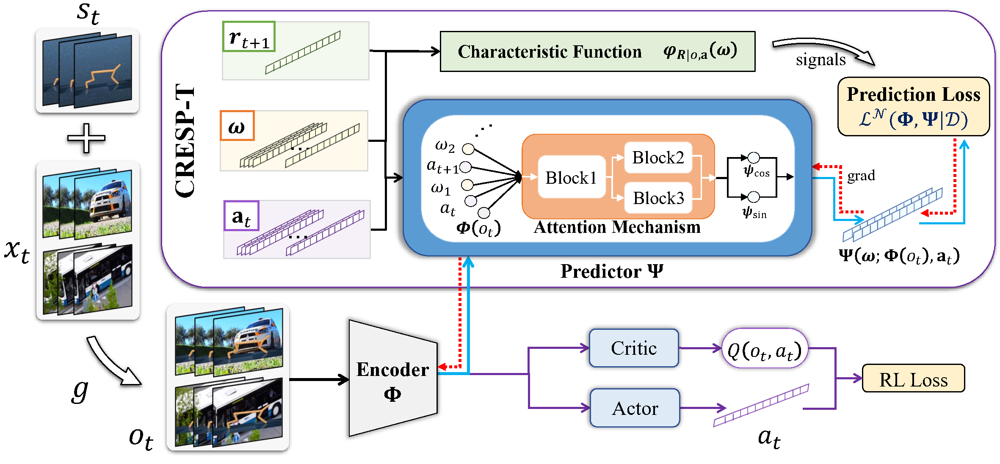

# Generalization in Visual Reinforcement Learning with the Reward Sequence Distribution

<p align="center">
  
</p>

This code is an enhanced version---namely, **CRESP-T**---of the proposed approach (CRESP) in **Learning Task-relevant Representations for Generalization via Characteristic Functions of Reward Sequence Distributions**. Rui Yang, Jie Wang*, Zijie Geng, Mingxuan Ye, Shuiwang Ji, Bin Li, Feng Wu. SIGKDD 2022. \[[arXiv](https://arxiv.org/abs/2205.10218)\]

CRESP extends the state-of-the-art pixel-based continuous control algorithms, DrQ, to the visual distraction settings for generalization (see **`distracting_control`** suite). It improves the generalization performances in unseen test environments with dynamic backgrounds or color distractions.
Based on CRESP, CRESP-T significantly improves the robustness of CRESP by introducing more effective optimization objective and architecture.

## Requirements

Python 3.8.13
PyTorch 1.12.1
tqdm
dm_control 1.0.5
mujoco-py 2.1.2.14

```
pip install -r requirements.txt
```
<!-- `conda install -y tensorboard` -->


## Reproduce the Results

For example, run experiments on Walker Walk with dynamic backgrounds:

``` bash
bash run.sh
```
Note that you need to set the `data_path` when conducting experiments with dynamic backgrounds.
The `num_sources` is the number of training environments which have different background distractions.

We also provide the code in `run.sh` for experiments on Walker Walk with dynamic color distractions.

The file structure of this branch `cresp_t` is:

```
RL-CRESP
└───VRL
│   └───cfgs
│   │   └───algo
│   │   │   ...
│   │   └───task
│   │   │   ...
│   |   ...
│   └───dcs_make_env
│   │   ...
│   ...
└───distracting_control
│   ...
```


## Citation

If you find this code useful, please consider citing the following paper.

## Remarks

```
@article{yang2022learning,
  title={Learning Task-relevant Representations for Generalization via Characteristic Functions of Reward Sequence Distributions},
  author={Yang, Rui and Wang, Jie and Geng, Zijie and Ye, Mingxuan and Ji, Shuiwang and Li, Bin and Wu, Feng},
  journal={arXiv preprint arXiv:2205.10218},
  year={2022}
}
```
